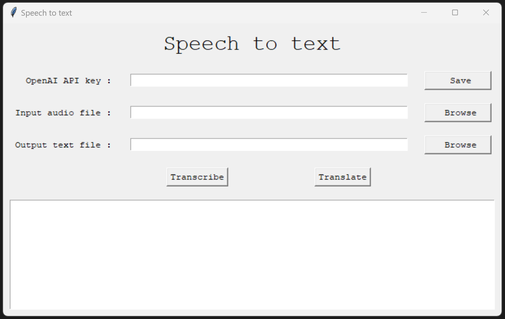

# speechToText_GUI
A python based windows graphical interface to use openAI speechToText.

You can either download the standalone spech_to_text.exe file meant to be run without any prior instllation of python and dependancies (built with pyinstaller --onefile) or follow the following installtion instruction for use/modification with python. 

How to install: 

1) Install [python3](https://docs.python.org/fr/3/using/windows.html)
   
2) Install openAI API by running the following in a windows powershell:
```
 pip install openai
```

3) Get yourself an [openAI API key](https://help.openai.com/en/articles/4936850-where-do-i-find-my-secret-api-key)

How to run: 

1) Double click on speech_to_text.py file (or right click/open with/Python)

2) Insert your openAI API key in the first field, save your openAI key in your environment variables by clicking the 'save' button. That way, you won't need to copy you openAI API key at every launch. 

3) Select your input audio file in the second field. 

4) (Optional) Select your output text file in the third field. 

5) Run either Transcribe or translate

6) Enjoy!


